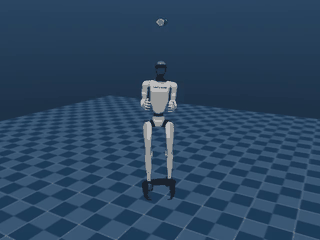
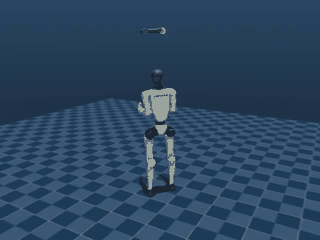
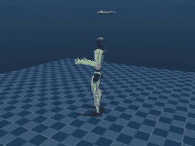
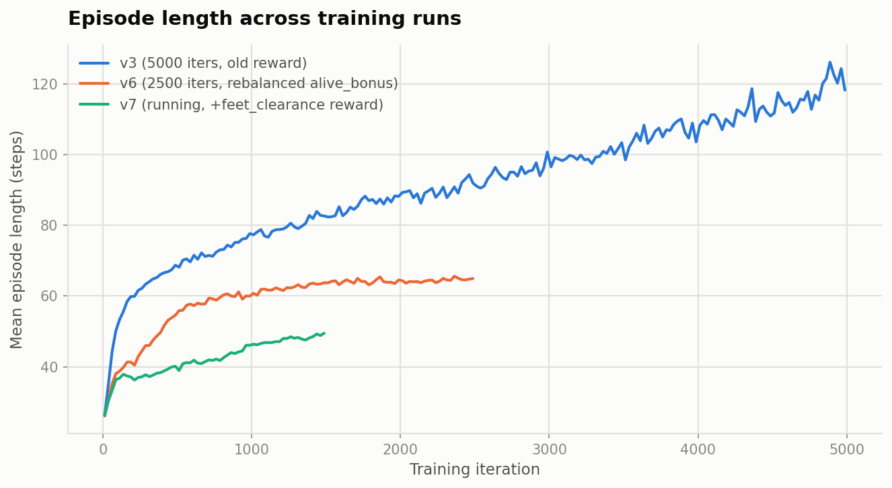
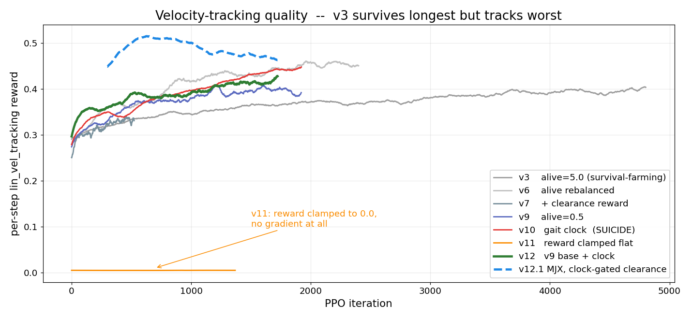

# Robust Humanoid Locomotion (Unitree G1)

[](https://huggingface.co/buckets/Drew0681/mhn_Loc_PPO_RL)
[](https://wandb.ai/shubhamt2897-hochschule-schmalkalden/g1_robust_locomotion)
[](src/README.md)

## Objective

A walking policy for the Unitree G1 humanoid (29-DOF), trained in MuJoCo with PPO. The end goal
is a policy that's **robust to disturbances it has to infer from its own senses** -- pushes,
shifted payload, uneven ground -- using only proprioception (joint angles/velocities, IMU, its
own recent actions), the same limited information the real hardware would have. No cameras, no
privileged state at deployment time.

## Current status

**Not walking yet -- but clearly above baseline, and the reward function is no longer fighting
itself.** Domain randomization (payload mass/CoM, pushes) is active during training, but the
project is still at the milestone of staying upright and taking real steps on flat ground.

The `v12` runs added a fixed 0.8 s alternating gait clock (driving both a contact reward and two
observation terms) on top of the `v9` reward baseline, and `v12.1` gated the foot-clearance reward
on that clock to close a jumping exploit. Two things came out of it:

- The **suicide policy is fixed**. `v10` had `corr(reward, episode_length) = -0.701` -- it learned
  that dying early was cheaper than living, and its final policy survived *less* long than an
  untrained network. Enabling `only_positive_rewards` (the legged_gym default, whose own comment
  reads *"avoids early termination problems"*) and applying the missing `control_dt` factor to
  every reward weight flipped that correlation to **+0.98**.
- There is now a **real margin over an untrained network**: 60.7 vs 39.5 steps mean survival, and
  airborne time drops from 28.2% to 4.6%.

Full run-by-run diagnostic history: `PROGRESS.md` (local working log, gitignored).

## Best checkpoints

Two training backends were built: the original serial-MuJoCo one, and an MJX (GPU-batched) one.
Best checkpoint from each, **both evaluated identically** -- 16 envs x 3000 steps (60 s) on the
full-collision MuJoCo model, against an untrained network as the floor:

| | **MuJoCo** `v12_v9base_clock/model_1750` | **MJX** `v121_mjx_nojump/model_1798` | untrained |
|---|---|---|---|
| episode length mean / median | **60.7** / 58.0 | 60.2 / 56.0 | 39.5 / 38.0 |
| longest single episode | 138 (2.76 s) | **176 (3.52 s)** | 101 (2.02 s) |
| mean torso tilt | 16.4 deg | 17.1 deg | 11.2 deg |
| velocity tracking error | **0.700 m/s** | 0.801 m/s | 0.945 m/s |
| both feet planted | 31.2 % | **40.9 %** | 37.0 % |
| airborne (no foot down) | **4.6 %** | 9.3 % | 28.2 % |
| contact transitions / s | 17.61 | **12.04** | 21.47 |

60-second continuous captures, `--auto_reset` on so falls respawn (not curated -- this is typical
behaviour, including every fall):

- **MuJoCo best:** [media/v12_mujoco_best/model_1750_20260904_075253.mp4](media/v12_mujoco_best/model_1750_20260904_075253.mp4)
- **MJX best:** [media/v121_mjx_best/model_1798_20260904_075904.mp4](media/v121_mjx_best/model_1798_20260904_075904.mp4)

One caveat worth stating plainly: during training the MJX run logged 176.6 mean episode length
against MuJoCo's 61.5, which looks like a 2.9x win. It is not a like-for-like number. MJX runs a
reduced collision set (foot spheres only, no mesh self-collision), so episodes survive longer
inside it for reasons that do not transfer. Re-evaluated on the same full-collision model, the two
are **statistically tied**. Training-log episode lengths are only comparable within a backend.

## Method, in brief

PPO (`rsl_rl`), with an asymmetric actor-critic split: the deployed policy sees only what real
hardware could sense, while the critic (training-time only) additionally sees privileged
simulator state -- true velocity, ground-reaction forces, the exact randomized payload/friction --
to give it a sharper learning signal without leaking into the deployed policy. Full architecture,
reward function, PPO hyperparameters, and the complete diagnostic history of what's been tried and
why: **[src/README.md](src/README.md)**.

## Results

### Training progression

Single continuous 6-second rollouts (no reset), same fixed camera, same MuJoCo viewer, captured
via `play.py --headless`. Not curated highlights -- the actual, typical behavior at each
checkpoint, looping automatically below (higher-res `.mp4` originals linked underneath each):

<table>
<tr>
<td align="center" width="50%"><b>Random init</b></td>
<td align="center" width="50%"><b><code>v3</code> (5000 iters, old reward)</b></td>
</tr>
<tr>
<td align="center"></td>
<td align="center"></td>
</tr>
<tr>
<td align="center">No training at all -- collapses within about a second.<br/><a href="media/progression/01_random_init.mp4">full-res .mp4</a></td>
<td align="center">Stands, but braces in a stiff, defensive "arms-forward" stance before eventually toppling forward.<br/><a href="media/progression/02_v3_5000iter_old_reward.mp4">full-res .mp4</a></td>
</tr>
<tr><td colspan="2">&nbsp;</td></tr>
<tr>
<td align="center" colspan="2"><b><code>v6</code> (2500 iters, rebalanced reward)</b></td>
</tr>
<tr>
<td align="center" colspan="2"></td>
</tr>
<tr>
<td align="center" colspan="2">Stands with arms hanging naturally rather than braced -- direct result of
rebalancing <code>alive_bonus</code> so survival stops dominating the reward (see
<a href="src/README.md">src/README.md</a>). Still falls; doesn't yet attempt to lift a foot.<br/>
<a href="media/progression/03_v6_2500iter_rebalanced.mp4">full-res .mp4</a></td>
</tr>
</table>

### Training curves

Two metrics, three runs -- read together, not separately. `v3` "wins" on raw survival time, but
that's mostly a reward-shaping artifact (a large `alive_bonus` rewarding survival regardless of
tracking quality). `v6` and `v7` -- with that bonus rebalanced down to Unitree's own official
value -- reach *better* velocity-tracking quality in under half the iterations, which is the
metric that actually reflects walking ability:

<table>
<tr>
<td width="50%"></td>
<td width="50%"></td>
</tr>
</table>

Live, explorable versions of every logged metric (not just these two) are on
[Weights & Biases](https://wandb.ai/shubhamt2897-hochschule-schmalkalden/g1_robust_locomotion).

### Where it still falls short

Neither policy walks. The best single episode is 3.5 s, and across a 60 s capture each model falls
roughly 780 times -- what improved is that it now falls *slowly and upright* (16-17 deg mean tilt,
4-9% airborne) instead of collapsing. The clearest remaining defect is **cadence**: the gait clock
schedules 2.5 contact transitions per second, and both policies run at 12-17.6, i.e. **5-7x too
fast**. They satisfy the clocked contact reward partly by foot-chatter rather than by stepping,
which is why `reward/contact` looked healthy in training (0.76 of a 1.0 maximum) while the actual
gait did not exist. Velocity tracking is also only modestly better than an untrained network
(0.70-0.80 vs 0.945 m/s), so command-following is weak. Cadence, not survival, is the next lever --
and nothing currently logged during training would have revealed the clock was being tracked at 5x
the intended rate; that measurement only exists in post-hoc evaluation.

## Checkpoints

All checkpoints (`model_<N>.pt`, `rsl_rl`/PPO format) and each run's TensorBoard event file are in
the HF bucket, organized by run name:

**[huggingface.co/buckets/Drew0681/mhn_Loc_PPO_RL](https://huggingface.co/buckets/Drew0681/mhn_Loc_PPO_RL)**

```
hf buckets ls Drew0681/mhn_Loc_PPO_RL/v121_mjx_nojump
hf buckets cp hf://buckets/Drew0681/mhn_Loc_PPO_RL/v121_mjx_nojump/model_1798.pt ./model_1798.pt
```

Runs earlier than `v10` live in the previous bucket `shubhamt0802/hmn_loc_RL` and were not
migrated. To replay either of the two best checkpoints (`play.py` always renders through MuJoCo,
so MJX-trained weights load fine -- the policy is just an MLP):

```
python play.py --checkpoint models/v12_v9base_clock/model_1750.pt    # MuJoCo best
python play.py --checkpoint models/v121_mjx_nojump/model_1798.pt     # MJX best
```

## Quickstart

```
conda activate humanoid_locomotion
python check_env.py                                        # verify the environment
python train.py --num_envs 2 --device cpu --iterations 20 --run_name smoke_test
python play.py --checkpoint logs/smoke_test/model_19.pt     # visual check via mujoco viewer
```

Full setup (Colab/HF Jobs cloud training, headless checkpoint review, ONNX export) is in
**[src/README.md](src/README.md)**.
